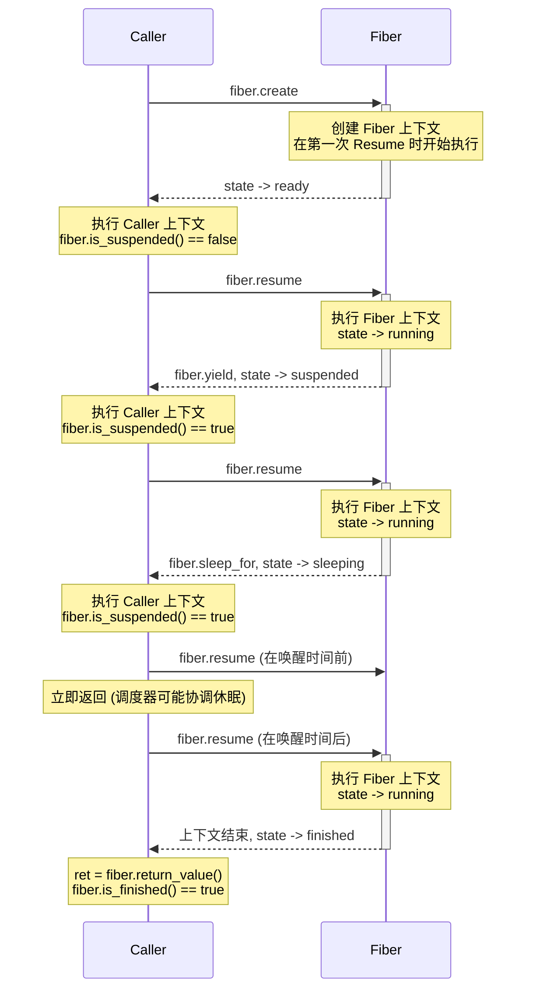
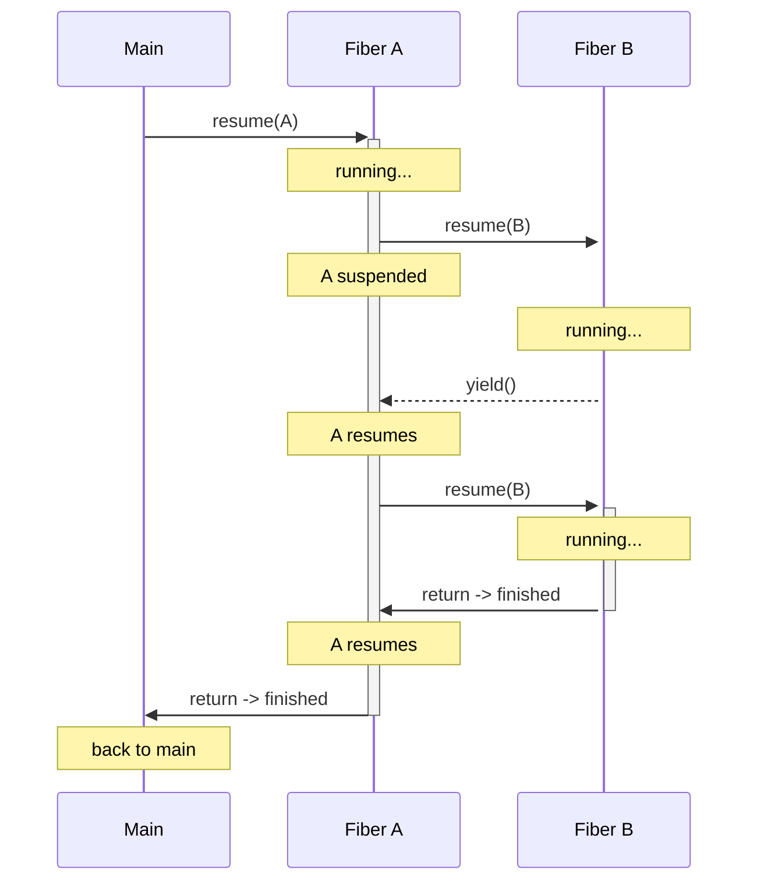
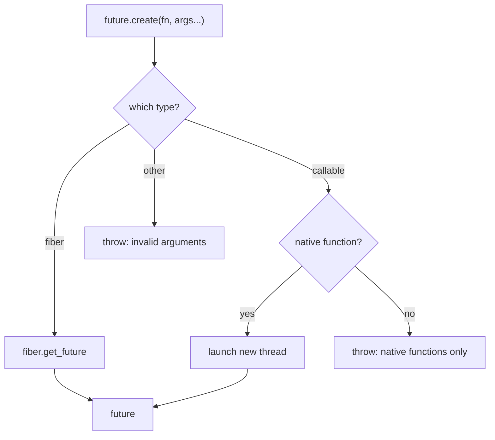

# CovScript 异步机制

## 设计 & 理念

CovScript 的设计目标之一是以较小侵入性与 C++ 代码互操作。引入多线程异步支持需要对 CNI 层进行较多侵入式改造。等待 I/O 是最常见的异步场景，这种情况下语言级多线程并非必需，反而会增加编程复杂度。因此 CovScript 推荐使用协程作为异步的基础设施，SDK 同时提供 C++ 层与 CovScript 语义一致的 Fiber 特性。

## Fiber（协程）

Fiber 是轻量级的、协作式调度的执行上下文。与操作系统线程不同，同一时刻只有一个 fiber 在运行，且上下文的切换由 `resume`、`yield` 或 `sleep_for` 显式触发。

### 生命周期



Fiber 结束后不能再次 `resume()`，否则会抛出异常。

### 嵌套 Fiber

一个 fiber 可以 `resume()` 另一个 fiber，形成调用栈。调用方 fiber 会挂起，直到被调方 fiber yield 或完成。



`fiber.current()` 和 `fiber.within()` API 允许 fiber 检查自身上下文。调度器维护一个 fiber 调用栈，当从 A 内部调用 `resume(B)` 时，A 入栈，B 运行；当 B yield 或完成时，A 出栈并被恢复。

### API

```covscript
# 从函数创建 fiber
var f = fiber.create(func, arg1, arg2, ...)

# 状态查询
f.is_running()
f.is_suspended()
f.is_finished()

# 控制
f.resume()              # 推进 fiber；已完成时抛异常
fiber.yield()           # 在 fiber 内部让出控制权
fiber.sleep_for(ms)     # 在 fiber 内部休眠
fiber.current()         # 获取当前 fiber（不在 fiber 内则返回 null）
fiber.within()          # 判断当前是否在 fiber 内部

# 返回值
f.return_value()   # 获取 fiber 返回值（必须已完成）

# 从 fiber 创建 future
var fut = f.get_future()
```

### 创建 Fiber

`fiber.create` 接受两种可调用对象：

- **CovScript 函数**：在 fiber 内以完整解释器上下文运行。可以调用其他 CovScript 函数、`yield` 和 `sleep_for`。
- **C++ 函数**：适用于不需要 CovScript 运行时的 C++ 回调，如需让出上下文可主动调用 `cs::fiber::yield()` 或 `cs::fiber::sleep_for(ms)`。详见 [C++ API](#c-api)

### 调度策略

控制 fiber 处于 sleeping 状态时调度器的退避强度。

```covscript
fiber.set_schedule_policy("balanced")     # 默认
fiber.set_schedule_policy("responsive")   # 低延迟
fiber.set_schedule_policy("efficient")    # 低 CPU
fiber.set_schedule_policy("throughput")   # 高负载均衡
```

机制：当对尚未到达唤醒时间的 fiber 调用 `resume()` 时，调度器使用累进式退避。重复的过早唤醒会逐渐增加休眠时长，避免 CPU 空转的同时保持对定时唤醒的响应。

### 弃用的 Fiber 与 COVSCRIPT_DEBUG

Fiber 采用协作式清理：在最后一个句柄被释放前，它必须运行到完成（或被驱动到 `finished`）。销毁仍处于 `running`、`suspended` 或 `sleeping` 状态的 fiber 无法解开其挂起的栈帧，因此这些帧持有的资源会泄漏。这是协作式契约，而非运行时错误。

销毁未完成 fiber 时的行为由 `COVSCRIPT_DEBUG` 环境变量控制：

| 取值 | 行为 |
| :-- | :-- |
| `none` | 什么都不做：fiber 的栈块仍被释放，挂起帧静默泄漏，程序继续 |
| `warning` | 向 stderr 打印 `[fiber] warning: destroying an unfinished fiber ...` 并继续（默认） |
| `strict` | 打印警告后立即中止（fail-fast） |

`COVSCRIPT_DEBUG` 大小写不敏感；未设置或非法值默认按 `warning` 处理。同一开关也控制其他防御性运行时守卫（例如程序入口处函数值栈非空）。

### C++ API

#### 类型

```cpp
namespace cs {
    using fiber_t = std::shared_ptr<fiber_type>;
}
```

`fiber_t` 是 fiber 的引用计数句柄。`fiber_type` 为抽象基类，不同平台有各自的实现。

```cpp
enum class fiber_state {
    ready,      // 已创建，尚未开始执行
    running,    // 正在执行
    suspended,  // 通过 yield() 挂起
    sleeping,   // 通过 sleep_for(ms) 休眠
    finished    // 已执行完毕
};
```

#### fiber_type

```cpp
// 查询当前状态
fiber_state fiber_type::get_state() const;

// 获取返回值（仅 finished 状态可调用，否则抛异常）
var fiber_type::return_value() const;
```

#### 创建

```cpp
// 创建带有解释器上下文的 fiber（CovScript 函数）
fiber_t create(const context_t &ctx, std::function<var()> fn);

// 创建无解释器上下文的 fiber（原生 C++ 函数）
fiber_t create_native(std::function<var()> fn);
```

`create` 需要 `context_t` 以构建 fiber 内部的变量作用域和栈，适合执行 CovScript 函数。`create_native` 不需要解释器上下文，适合执行纯 C++ 回调。两种 fiber 均可通过 `resume`、`yield`、`sleep_for` 控制。

#### 调度

```cpp
enum class schedule_policy {
    normal,           // 累进式自动退避
    no_backpressure,  // 跳过自动退避
};

// 推进 fiber
void resume(const fiber_t &fiber, schedule_policy = schedule_policy::normal);

// 在 fiber 内部让出控制权
void yield();

// 在 fiber 内部休眠指定毫秒数
void sleep_for(std::size_t ms);
```

`resume()` 调用流程：

1. 检查 fiber 是否为 `ready` -> 创建上下文
2. 检查 fiber 是否为 `sleeping` 且未到唤醒时间 -> 根据 `schedule_policy` 决定是否退避休眠，然后返回
3. 切换到 fiber 上下文执行
4. fiber yield/sleep/完成 -> 切回调用者上下文

从 CovScript 调用 `fiber.resume()` 时始终使用 `normal` 策略，确保脚本层有完整的平台退避。

#### 查询

```cpp
// 获取当前正在执行的 fiber（不在 fiber 中返回 nullptr）
fiber_type const *current();

// 判断当前是否在 fiber 上下文中
bool within();
```

#### 桥接 Future

```cpp
// 将 fiber 包装为 future，返回统一的 future_t 句柄
future_t get_future(const fiber_t &fiber);
```

`get_future` 将 fiber 包装为 `future` 对象。之后可通过 `wait_for`/`wait`/`get` 统一消费，与 `future.create` 创建的 future 使用相同的 API。

#### 典型用法

```cpp
// 创建并启动 fiber
auto fib = cs::fiber::create(ctx, []() -> cs::var {
    cs::fiber::sleep_for(100);  // fiber 内休眠 100ms
    return cs::var::make<cs::numeric>(42);
});

// 轮询直到完成
while (fib->get_state() != cs::fiber_state::finished)
    cs::fiber::resume(fib);

// 获取结果
cs::var result = fib->return_value();  // 42
```

```cpp
// 通过 future 消费（推荐）
auto fut = cs::fiber::get_future(fib);
fut->wait();
cs::var result = fut->get();  // 42，可多次调用
```

#### 自定义退避参数

当内置策略不满足需求时，可在 C++ 层直接设置退避系数和最小休眠时间：

```cpp
// 退避系数（渐进倍率）
cs::current_process->fiber_cxt->busy_wait_coef = 0.01;
// 最小休眠时间（毫秒）
cs::current_process->fiber_cxt->busy_wait_min = 10;
```

CovScript 层推荐使用 `fiber.set_schedule_policy()` 选择预设策略；C++ 层可自由调参。

## Future

`future` 表示可能异步完成的计算。抽象接口提供三个操作：

| 方法 | 返回 | 语义 |
|------|------|------|
| `wait_for(ms)` | `bool` | 带超时的轮询：就绪返回 `true` |
| `wait()` | `void` | 阻塞直到就绪 |
| `get()` | `var` | 阻塞直到就绪，返回结果（可多次调用） |

三者既可作为成员函数（`fut.wait_for(100)`）也可作为自由函数（`future.wait_for(fut, 100)`）调用。
注意：`wait()` 和 `wait_for()` 不会抛出任务异常；异常仅在首次调用 `get()` 时传播，后续 `get()` 返回相同结果。

### 创建 Future



```covscript
# 从 C++ 函数创建（在后台线程运行）
var fut = future.create(native_fn, arg1, arg2, ...)

# 从已有 fiber 创建
var fut = future.create(fiber_obj)
# 或等价地：
var fut = fiber_obj.get_future()
```

**仅限 C++ 函数。** 出于线程安全考虑，以可调用对象为参数的 `future.create` 要求原生（C++）函数。CovScript 函数不能在后台线程上运行，因为解释器状态不是线程安全的。如需异步执行 CovScript 代码，请使用 `fiber.create` + `future.create(fiber)`。

传入非原生可调用对象时，`future.create` 抛出 `"Async future can only be created from native functions"`。如果第一个参数既不是 fiber 也不是可调用对象，抛出 `"The target value is not callable or fiber"`。

### 消费 Future

```covscript
var fut = future.create(runtime.sleep_for, 1000)

# 带超时轮询
while !fut.wait_for(100)
    # 做其他工作
end

# 阻塞直到就绪
fut.wait()

# 获取结果（可多次调用）
var result = fut.get()

# 便捷写法：创建并立即等待
var result = runtime.await(native_fn, arg1, arg2)
```

`runtime.await` 等价于 `future.create(...).get()`。在 fiber 内部它协作式轮询；在 fiber 外部它同步运行（不创建线程）。

### Fiber 内 vs Fiber 外的行为

Future 的消费方式会适配调用上下文：

| 上下文 | `wait()` / `wait_for()` 行为 |
|--------|----------------------------|
| Fiber 内部 | 使用 `fiber.sleep_for()` 轮询，协作式，不阻塞 OS 线程 |
| Fiber 外部 | 直接阻塞等待，不进行轮询 |

轮询休眠时长使用感知截止时间的公式，避免过度休眠：

```
wait_time = max(remain_ms * coef, min)
wait_time = min(wait_time, remain_ms)
```

### C++ API

```cpp
namespace cs {
    using future_t = std::shared_ptr<future_type>;

    class future_type {
    protected:
        future_type() = default;

    public:
        future_type(const future_type &) = delete;
        future_type &operator=(const future_type &) = delete;

        virtual ~future_type() = default;

        virtual bool wait_for(std::size_t ms) = 0;

        virtual void wait() = 0;

        virtual var get() = 0;
    };
}
```

C++ 层可通过继承 `cs::future_type` 实现自定义 future，与 CovScript 原生机制互操作。只需重写三个纯虚方法：

- `wait_for(ms)` — 返回 `true` 表示就绪，不抛异常
- `wait()` — 阻塞直到就绪，不抛异常
- `get()` — 阻塞直到就绪后返回结果；若任务执行中抛出异常，应在 `get()` 中重抛

内建的 Future 均以此为基类，使用者可按相同模式扩展。为保持运行时多态，建议定义专门的工厂函数（可参考 `fiber.get_future()` 和 `future.create` 的命名模式），返回前通过 `static_cast<cs::future_t>` 将派生类指针转为统一句柄：

```cpp
future_t make_my_future(args...) {
    return static_cast<future_t>(std::make_shared<my_future_type>(args...));
}
```

## Runtime API

```covscript
# 协作式等待：Fiber 内等价于 fiber.sleep_for(ms)，Fiber 外等价于 runtime.sleep_for(ms)
# 适合需要兼容同步和异步场景的代码
runtime.delay(ms)
# 无条件阻塞当前线程
runtime.sleep_for(ms)
```

## 原生支持异步的 CovScript 扩展

CovScript 运行时未内置异步事件循环。各扩展自行维护事件循环可以获得更高效率，且能更好地适配底层库的特性。以下扩展均原生支持 Fiber 协同调度，可在脚本层通过 `yield`/`sleep_for` 参与协作。

### Network（推荐）

[Network 扩展](https://github.com/covscript/covscript-network) 基于 [ASIO](https://think-async.com/Asio/) 和 OpenSSL，提供完整的异步网络能力：

- **TCP/UDP 套接字**：连接、监听、收发、广播，支持 IPv4/IPv6
- **TLS/SSL 加密**：可配置信任模式（自动/OpenSSL/自定义/不安全）
- **异步 I/O 事件循环**：`async.poll` / `async.poll_once`，配合 `thread_worker` 和 `work_guard` 实现 Fiber 协同
- **HTTP 服务端/客户端**（`netutils` 包）：多 worker、keep-alive、静态文件服务、自定义路由、OpenAI/DeepSeek API 客户端
- **分布式多节点**：Master/Slave 架构，TCP IPC 水平扩展
- **反向代理**：基于前缀的请求转发，`X-Forwarded-For` 注入

其中 `network.async` 命名空间提供的 CNI 函数均原生支持 Fiber 协同调度。基于此扩展编写的 Netutils 库现已用于 CovScript 官网的后台 HTTP 服务。

### Process（推荐）

[Process 扩展](https://github.com/covscript/covscript-process) 基于 Mozart++ 和 libuv，提供异步进程管理和文件 I/O：

- **子进程管理**：`process.exec` / `process.shell` 启动，Builder 模式链式配置
- **进程等待**：`wait` / `try_wait` / `wait_poll` / `wait_with`，支持超时
- **进程间通信**：`communicate()` 同时收集 stdout/stderr，避免管道阻塞
- **异步文件 I/O**：`file_t` + `process.async.fstream`，配合 `redirect_out`/`redirect_err`
- **异步事件循环**：`process.async.poll` / `poll_once` / `stop` / `restart`
