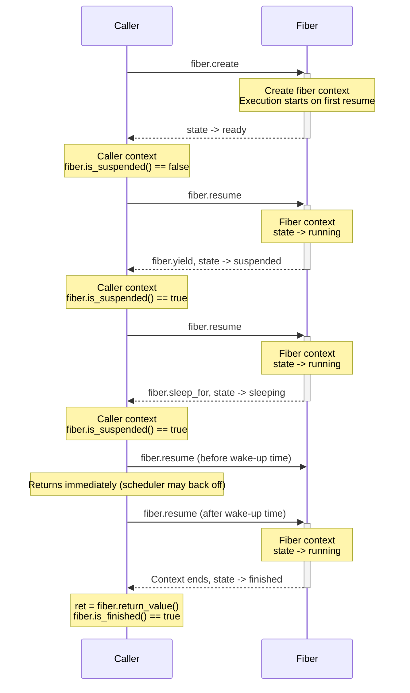
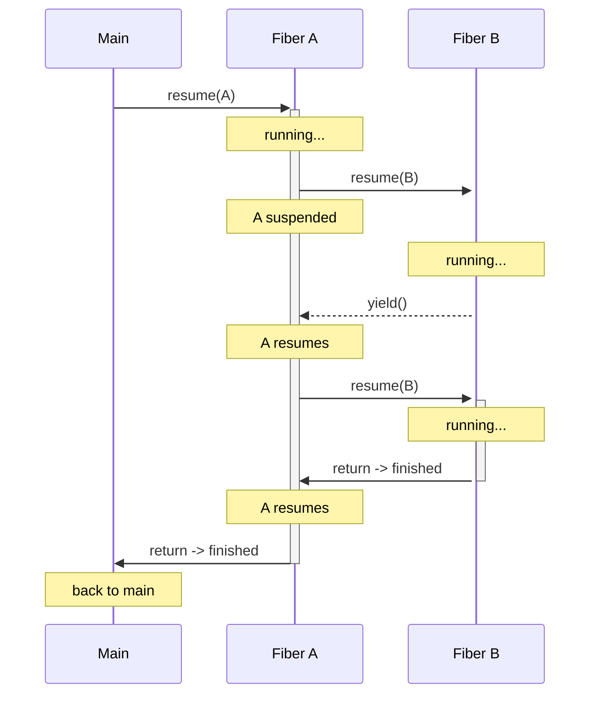
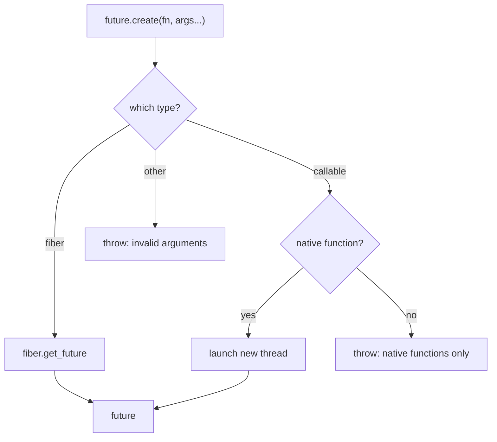

# CovScript Asynchronous Mechanism

## Design Philosophy

One of CovScript's design goals is to interoperate with C++ with minimal intrusiveness. Adding multi-threaded async support would require significant changes to the CNI layer. Waiting on I/O is the most common async scenario, where language-level multi-threading is unnecessary and adds complexity. CovScript therefore recommends coroutines as the foundation for asynchronous programming, with the SDK providing Fiber features that share the same semantics across C++ and CovScript.

## Fiber (Coroutine)

Fibers are lightweight, cooperatively scheduled execution contexts. Unlike OS threads, only one fiber runs at a time — switching happens explicitly via `resume`, `yield`, or `sleep_for`.

### Lifecycle



A finished fiber cannot be `resume()`d again — doing so throws an exception.

### Nested Fibers

A fiber can `resume()` another fiber, forming a call stack. The caller fiber is suspended until the callee fiber yields or finishes.



The `fiber.current()` and `fiber.within()` APIs allow a fiber to inspect its own context. The scheduler maintains a fiber call stack — when `resume(B)` is called from inside A, A is pushed, B runs, and when B yields or finishes, A is popped and resumed.

### API

```covscript
# Create a fiber from a function
var f = fiber.create(func, arg1, arg2, ...)

# State queries
f.is_running()
f.is_suspended()
f.is_finished()

# Control
f.resume()              # advance the fiber; throws if finished
fiber.yield()           # yield control from within a fiber
fiber.sleep_for(ms)     # sleep from within a fiber
fiber.current()         # get current fiber (null if not in one)
fiber.within()          # true if currently inside a fiber

# Result
f.return_value()   # get the fiber's return value (must be finished)

# Create a future from a fiber
var fut = f.get_future()
```

### Creating Fibers

`fiber.create` accepts two kinds of callables:

- **CovScript functions**: runs inside the fiber with full interpreter context. Can call other CovScript functions, `yield`, and `sleep_for`.
- **C++ functions**: suitable for C++ callbacks that don't need the CovScript runtime. To yield, call `cs::fiber::yield()` or `cs::fiber::sleep_for(ms)`. See [C++ API](#c-api-1).

### Scheduling Policy

Controls how aggressively the scheduler backs off when a fiber is sleeping.

```covscript
fiber.set_schedule_policy("balanced")     # default
fiber.set_schedule_policy("responsive")   # lower latency
fiber.set_schedule_policy("efficient")    # lower CPU usage
fiber.set_schedule_policy("throughput")   # high-load balance
```

When `resume()` is called on a sleeping fiber whose wake-up time has not arrived, the scheduler uses progressive backoff. Repeated premature attempts gradually increase the sleep duration, preventing CPU spin while remaining responsive to scheduled wake-ups.

### Leaked Fibers and COVSCRIPT_DEBUG

Fibers are cleaned up cooperatively: they must run to completion (or be driven to `finished`) before their last handle is dropped. Destroying a fiber that is still `running`, `suspended` or `sleeping` cannot unwind its suspended stack frames, so any resources held by those frames are leaked. This is a cooperative contract, not a runtime error.

The behaviour when an unfinished fiber is destroyed is controlled by the `COVSCRIPT_DEBUG` environment variable:

| Value | Behaviour |
| :-- | :-- |
| `none` | Do nothing: the fiber's stack block is still released, the suspended frames are leaked silently, the program continues |
| `warning` | Print `[fiber] warning: destroying an unfinished fiber ...` to stderr and continue (default) |
| `strict` | Print the warning and abort immediately (fail-fast) |

`COVSCRIPT_DEBUG` is case-insensitive; an unset or unknown value defaults to `warning`. The same switch governs other defensive runtime guards (for example a non-empty function value stack at program entry).

### C++ API

#### Types

```cpp
namespace cs {
    using fiber_t = std::shared_ptr<fiber_type>;
}
```

`fiber_t` is the reference-counted handle for fibers. `fiber_type` is an abstract base class with platform-specific implementations.

```cpp
enum class fiber_state {
    ready,      // created, not yet started
    running,    // currently executing
    suspended,  // suspended via yield()
    sleeping,   // sleeping via sleep_for(ms)
    finished    // execution completed
};
```

#### fiber_type

```cpp
// Query current state
fiber_state fiber_type::get_state() const;

// Get return value (only valid when finished; throws otherwise)
var fiber_type::return_value() const;
```

#### Creation

```cpp
// Create a fiber with interpreter context (CovScript functions)
fiber_t create(const context_t &ctx, std::function<var()> fn);

// Create a fiber without interpreter context (native C++ functions)
fiber_t create_native(std::function<var()> fn);
```

`create` requires a `context_t` to build the fiber's variable scope and stack, suitable for CovScript functions. `create_native` requires no interpreter context, suitable for pure C++ callbacks. Both can be controlled via `resume`, `yield`, and `sleep_for`.

#### Scheduling

```cpp
enum class schedule_policy {
    normal,           // progressive automatic backoff
    no_backpressure,  // skip automatic backoff
};

// Advance the fiber
void resume(const fiber_t &fiber, schedule_policy = schedule_policy::normal);

// Yield control from within a fiber
void yield();

// Sleep for a specified number of milliseconds from within a fiber
void sleep_for(std::size_t ms);
```

`resume()` call flow:

1. If `ready` — create execution context
2. If `sleeping` and wake-up time not reached — back off or return immediately depending on `schedule_policy`
3. Context-switch into the fiber
4. Fiber yields/sleeps/finishes — switch back to caller

When calling `fiber.resume()` from CovScript, the `normal` policy is always used, ensuring full platform backoff at script level.

#### Queries

```cpp
// Get the currently executing fiber (nullptr if not in one)
fiber_type const *current();

// Check if currently inside a fiber context
bool within();
```

#### Bridging to Future

```cpp
// Wrap a fiber as a future, returning a unified future_t handle
future_t get_future(const fiber_t &fiber);
```

`get_future` wraps a fiber into a `future` object. It can then be consumed through `wait_for`/`wait`/`get` using the same API as futures created by `future.create`.

#### Examples

```cpp
// Create and run a fiber
auto fib = cs::fiber::create(ctx, []() -> cs::var {
    cs::fiber::sleep_for(100);  // sleep 100ms inside the fiber
    return cs::var::make<cs::numeric>(42);
});

// Poll until finished
while (fib->get_state() != cs::fiber_state::finished)
    cs::fiber::resume(fib);

// Get the result
cs::var result = fib->return_value();  // 42
```

```cpp
// Consume via future (recommended)
auto fut = cs::fiber::get_future(fib);
fut->wait();
cs::var result = fut->get();  // 42, can be called multiple times
```

#### Custom Backoff Parameters

When the built-in policies are insufficient, the backoff coefficient and minimum sleep time can be tuned from C++:

```cpp
auto params = cs::fiber::get_schedule_parameters();
params.busy_wait_coef = 0.01;   // progressive multiplier
params.busy_wait_min = 10;      // minimum sleep time (milliseconds)
cs::fiber::set_schedule_parameters(params);
```

CovScript code should use `fiber.set_schedule_policy()` to pick a preset; C++ code can tune freely.

## Future

A `future` represents a computation that may complete asynchronously. The abstract interface provides three operations:

| Method | Returns | Semantics |
|--------|---------|-----------|
| `wait_for(ms)` | `bool` | Poll with timeout: `true` if ready |
| `wait()` | `void` | Block until ready |
| `get()` | `var` | Block until ready, then return result (idempotent) |

All three are available both as member methods (`fut.wait_for(100)`) and as free functions (`future.wait_for(fut, 100)`).
Note: `wait()` and `wait_for()` do not throw task exceptions; exceptions are only propagated on the first call to `get()`. Subsequent `get()` calls return the same result.

### Creating Futures



```covscript
# From a C++ function (runs on a background thread)
var fut = future.create(native_fn, arg1, arg2, ...)

# From an existing fiber
var fut = future.create(fiber_obj)
# or equivalently:
var fut = fiber_obj.get_future()
```

**C++ functions only.** For thread safety, `future.create` with a callable argument requires a native (C++) function. CovScript functions cannot run on background threads because the interpreter state is not thread-safe. To run CovScript code asynchronously, use `fiber.create` + `future.create(fiber)`.

Passing a non-native callable causes `future.create` to throw `"Async future can only be created from native functions"`. If the first argument is neither a fiber nor a callable, it throws `"Invalid call to 'future.create', the first argument must be a fiber or a callable object"`.

**The native-only guard covers only the direct callable.** A native function running on a worker thread must not interact with the CovScript runtime in any way: it must not call CovScript functions — directly, or indirectly through callables passed in its arguments (for example by invoking them via `invoke`/CNI) — and must not read or modify any runtime state (domains, the value stack, constants, and so on). Passing a CovScript callable as an argument and executing it on the worker thread is an unsupported usage and results in undefined behaviour (including data races on shared runtime state). If runtime interaction is required, run the work in a separate process instead.

### Consuming Futures

```covscript
var fut = future.create(runtime.sleep_for, 1000)

# Poll with timeout
while !fut.wait_for(100)
    # do other work
end

# Block until ready
fut.wait()

# Get the result (idempotent — can be called multiple times)
var result = fut.get()

# Convenience: create and immediately wait
var result = runtime.await(native_fn, arg1, arg2)
```

`runtime.await` is equivalent to `future.create(...).get()`. Inside a fiber it polls cooperatively; outside a fiber it runs synchronously (no thread spawned).

### Fiber vs Non-Fiber Behavior

Future consumption adapts to the calling context:

| Context | `wait()` / `wait_for()` behavior |
|---------|----------------------------------|
| Inside a fiber | Polling loop with `fiber.sleep_for()` — cooperative, does not block the OS thread |
| Outside a fiber | Direct blocking wait, no polling |

The polling sleep duration uses a deadline-aware formula to avoid oversleeping:

```
wait_time = max(remain_ms * coef, min)
wait_time = min(wait_time, remain_ms)
```

### C++ API

```cpp
namespace cs {
    using future_t = std::shared_ptr<future_type>;

    class future_type {
    protected:
        future_type() = default;

    public:
        future_type(const future_type &) = delete;
        future_type &operator=(const future_type &) = delete;

        virtual ~future_type() = default;

        virtual bool wait_for(std::size_t ms) = 0;

        virtual void wait() = 0;

        virtual var get() = 0;
    };
}
```

Custom futures can interoperate with CovScript by inheriting from `cs::future_type` and implementing three pure virtual methods:

- `wait_for(ms)` — returns `true` when ready; must not throw
- `wait()` — blocks until ready; must not throw
- `get()` — blocks until ready, then returns the result; rethrow any task exception here

The built-in futures all use this base class. To maintain runtime polymorphism, define a dedicated factory function (following the naming pattern of `fiber.get_future()` and `future.create`), and cast to the unified handle before returning:

```cpp
future_t make_my_future(args...) {
    return static_cast<future_t>(std::make_shared<my_future_type>(args...));
}
```

## Runtime API

```covscript
# Cooperative wait: equivalent to fiber.sleep_for(ms) inside a fiber,
# and runtime.sleep_for(ms) outside one. Suitable for code that needs
# to work in both synchronous and asynchronous contexts.
runtime.delay(ms)
# Unconditionally block the current thread.
runtime.sleep_for(ms)
```

## Async-Native CovScript Extensions

CovScript does not include a built-in async event loop. Each extension maintains its own event loop for better efficiency and tighter integration with the underlying library. The following extensions natively support Fiber cooperative scheduling — scripts can participate via `yield`/`sleep_for`.

### Network (Recommended)

The [Network Extension](https://github.com/covscript/covscript-network) is built on [ASIO](https://think-async.com/Asio/) and OpenSSL, providing comprehensive async networking:

- **TCP/UDP sockets** — connect, listen, send/receive, broadcast, IPv4/IPv6 support
- **TLS/SSL encryption** — configurable trust modes (auto/OpenSSL/custom/insecure)
- **Async I/O event loop** — `async.poll` / `async.poll_once`, with `thread_worker` and `work_guard` for fiber cooperation
- **HTTP server/client** (`netutils` package) — multi-worker, keep-alive, static file serving, custom routes, OpenAI/DeepSeek API client
- **Distributed multi-node** — master/slave architecture with TCP IPC for horizontal scaling
- **Reverse proxy** — prefix-based request forwarding with `X-Forwarded-For` injection

The `network.async` CNI functions all natively support Fiber cooperative scheduling. The Netutils library built on this extension currently powers the backend HTTP service for the CovScript website.

### Process (Recommended)

The [Process Extension](https://github.com/covscript/covscript-process) is built on Mozart++ and libuv, providing async process management and file I/O:

- **Subprocess management** — `process.exec` / `process.shell` launchers, Builder pattern for chainable configuration
- **Process waiting** — `wait` / `try_wait` / `wait_poll` / `wait_with` with timeout support
- **IPC** — `communicate()` collects stdout and stderr simultaneously, avoiding pipe deadlocks
- **Async file I/O** — `file_t` + `process.async.fstream`, combined with `redirect_out`/`redirect_err`
- **Async event loop** — `process.async.poll` / `poll_once` / `stop` / `restart`
